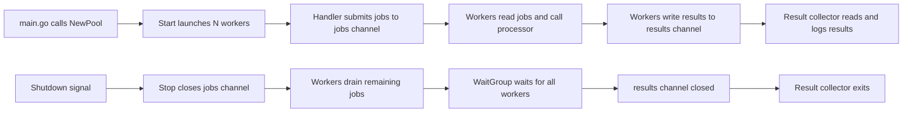

# Worker Pools with Goroutines and Channels

This document explains the concurrency model used by `supabase-insert-helper`. It covers the theory behind worker pools, the Go primitives involved, and how they are applied in this project.

---

## Table of Contents

- [What Is a Worker Pool?](#what-is-a-worker-pool)
- [Why Use a Worker Pool?](#why-use-a-worker-pool)
- [Core Go Concurrency Primitives](#core-go-concurrency-primitives)
- [The Producer-Consumer Pattern](#the-producer-consumer-pattern)
- [How This Project Implements It](#how-this-project-implements-it)
- [Lifecycle of the Pool](#lifecycle-of-the-pool)
- [Backpressure](#backpressure)
- [Graceful Shutdown](#graceful-shutdown)
- [Tuning the Worker Count](#tuning-the-worker-count)

---

## What Is a Worker Pool?

A worker pool is a concurrency pattern where a fixed number of workers process tasks from a shared queue. Instead of creating a new goroutine for every task, the program reuses a small, constant number of goroutines that repeatedly pull work from a channel.

Think of it as a supermarket with one checkout line and a fixed number of cashiers. Customers join the line; each cashier serves one customer at a time. The line absorbs short bursts, but if it grows too long the store is clearly overloaded.

---

## Why Use a Worker Pool?

Go makes it trivial to launch a goroutine per task:

```go
for _, url := range urls {
    go process(url)
}
```

This works for small workloads, but it does not scale when tasks involve I/O, network calls, or external APIs such as Supabase Storage:

| Problem | Cause |
|---|---|
| Resource exhaustion | Thousands of goroutines consume memory and open network connections. |
| Thundering herd | All uploads hit Supabase at once, triggering rate limits (`429`). |
| Hard to reason about | No obvious limit on concurrency; failures cascade unpredictably. |
| Poor shutdown behavior | There is no clean way to wait for all goroutines to finish. |

A worker pool solves these problems by:

- **Bounding concurrency**: only `N` workers run at any time.
- **Reusing goroutines**: workers are started once and live for the lifetime of the application.
- **Providing backpressure**: a buffered channel fills up when producers outpace consumers.
- **Enabling graceful shutdown**: `sync.WaitGroup` lets the program wait until every worker exits.

---

## Core Go Concurrency Primitives

### Goroutines

A goroutine is a lightweight thread managed by the Go runtime. It starts with a small stack that grows and shrinks automatically. The runtime multiplexes many goroutines onto a small number of operating-system threads.

```go
go func() {
    fmt.Println("running concurrently")
}()
```

### Channels

Channels are typed conduits for communicating between goroutines. They are the idiomatic way to share data in Go.

```go
ch := make(chan int)      // unbuffered: send blocks until someone receives
ch := make(chan int, 10)  // buffered: send blocks only when full
```

Closing a channel signals that no more values will be sent. Receivers detect this with the two-value form:

```go
v, ok := <-ch
// ok == false when the channel is closed and empty
```

### `sync.WaitGroup`

A `WaitGroup` waits for a collection of goroutines to finish. Each worker calls `Add(1)` before it starts and `Done()` when it exits. The shutdown logic calls `Wait()` to block until all workers are done.

```go
var wg sync.WaitGroup
wg.Add(1)
go func() {
    defer wg.Done()
    // work
}()
wg.Wait()
```

### `context.Context`

`context.Context` carries deadlines, cancellation signals, and request-scoped values across API boundaries and goroutines. In the pool it is used to:

- Cancel long-running downloads or uploads when the server shuts down.
- Time out individual HTTP requests.
- Abort job submission when an HTTP client disconnects.

---

## The Producer-Consumer Pattern

The worker pool is a specialization of the producer-consumer pattern:

- **Producer**: creates tasks and puts them into a queue.
- **Queue**: a channel that holds tasks.
- **Consumers**: a fixed set of workers that take tasks from the queue and execute them.

In this project:

| Role | Component |
|---|---|
| Producer | `api.ImageIngestHandler` |
| Queue | `jobs` channel inside `workers.Pool` |
| Consumers | `WORKER_COUNT` goroutines started by `pool.Start` |
| Output queue | `results` channel inside `workers.Pool` |
| Output consumer | Result collector goroutine |

---

## How This Project Implements It

### Data Structures

The worker pool is defined in `internal/workers/pool.go`:

```go path=/Users/albertomoranreina/Documents/Personal/micro-TFG/supabase-insert-helper/internal/workers/pool.go start=15
// Pool distributes image jobs across a fixed number of workers using channels.
type Pool struct {
	workers   int
	jobs      chan models.ImageJob
	results   chan models.ImageResult
	processor Processor
	wg        sync.WaitGroup
	done      chan struct{}
	stopOnce  sync.Once
}
```

- `workers`: number of concurrent goroutines.
- `jobs`: incoming task queue.
- `results`: outgoing result queue.
- `processor`: function each worker executes for one job.
- `wg`: tracks running workers for shutdown.
- `done`: signals that the pool has been stopped.
- `stopOnce`: guarantees `Stop` can only close channels once.

### Creating the Pool

```go path=/Users/albertomoranreina/Documents/Personal/micro-TFG/supabase-insert-helper/internal/workers/pool.go start=26
func NewPool(workers int, processor Processor) *Pool {
	if workers <= 0 {
		workers = 1
	}
	return &Pool{
		workers:   workers,
		jobs:      make(chan models.ImageJob, workers*8),
		results:   make(chan models.ImageResult, workers*8),
		processor: processor,
		done:      make(chan struct{}),
	}
}
```

Both channels are **buffered** with capacity `workers * 8`. This absorbs short bursts without blocking the HTTP handler, while still bounding memory usage.

### Starting Workers

```go path=/Users/albertomoranreina/Documents/Personal/micro-TFG/supabase-insert-helper/internal/workers/pool.go start=40
func (p *Pool) Start(ctx context.Context) {
	for i := 0; i < p.workers; i++ {
		p.wg.Add(1)
		go p.runWorker(ctx, i)
	}
	slog.Info("worker pool started", "workers", p.workers)
}
```

`Start` launches exactly `N` goroutines. Each one runs `runWorker` until the context is canceled or the `jobs` channel is closed.

### Worker Loop

```go path=/Users/albertomoranreina/Documents/Personal/micro-TFG/supabase-insert-helper/internal/workers/pool.go start=49
func (p *Pool) runWorker(ctx context.Context, id int) {
	defer p.wg.Done()
	for {
		select {
		case <-ctx.Done():
			slog.Info("worker shutting down", "id", id, "reason", ctx.Err())
			return
		case job, ok := <-p.jobs:
			if !ok {
				slog.Info("worker finished", "id", id)
				return
			}
			result := p.processor(ctx, job)
			select {
			case p.results <- result:
			case <-ctx.Done():
				return
			}
		}
	}
}
```

The worker uses a `select` to wait for either:

1. A cancellation signal (`ctx.Done()`).
2. A new job from the `jobs` channel.

When it receives a job, it runs the processor and then tries to send the result. The inner `select` also respects cancellation so a worker never hangs trying to write to a full `results` channel during shutdown.

### Submitting Jobs

```go path=/Users/albertomoranreina/Documents/Personal/micro-TFG/supabase-insert-helper/internal/workers/pool.go start=73
func (p *Pool) Submit(ctx context.Context, job models.ImageJob) error {
	select {
	case p.jobs <- job:
		return nil
	case <-p.done:
		return errors.New("worker pool is stopped")
	case <-ctx.Done():
		return ctx.Err()
	}
}
```

`Submit` is non-blocking with respect to cancellation and pool shutdown. If the `jobs` channel is full, it will wait for a slot, which provides backpressure to the HTTP handler.

### From HTTP Handler to Worker

The handler in `internal/api/image_handler.go` converts the validated payload into jobs:

```go path=/Users/albertomoranreina/Documents/Personal/micro-TFG/supabase-insert-helper/internal/api/image_handler.go start=34
for i, url := range payload.ImageURLs {
	job := models.ImageJob{
		URL:        url,
		BucketName: payload.BucketName,
		Index:      i,
	}
	if err := pool.Submit(r.Context(), job); err != nil {
		WriteError(w, http.StatusServiceUnavailable, "server is shutting down")
		return
	}
}
```

It then returns `202 Accepted` immediately, freeing the HTTP connection while workers continue in the background.

---

## Lifecycle of the Pool



---

## Backpressure

Backpressure is the mechanism by which a slow consumer tells a fast producer to slow down. In this design it happens naturally through buffered channels:

1. The HTTP handler submits jobs faster than workers can process them.
2. The `jobs` channel buffer fills up.
3. `Submit` blocks until a worker frees a slot.
4. The HTTP server accepts new connections more slowly because each handler spends more time submitting.

This is intentional. Without backpressure the system could queue an unbounded number of jobs in memory and eventually crash.

The buffer size `workers * 8` is a compromise:

- Large enough to absorb small bursts and keep workers busy.
- Small enough to prevent memory from growing uncontrollably under sustained load.

---

## Graceful Shutdown

```go path=/Users/albertomoranreina/Documents/Personal/micro-TFG/supabase-insert-helper/internal/workers/pool.go start=91
func (p *Pool) Stop() {
	p.stopOnce.Do(func() {
		close(p.jobs)
		p.wg.Wait()
		close(p.results)
		close(p.done)
		slog.Info("worker pool stopped")
	})
}
```

The shutdown sequence is carefully ordered:

1. `close(p.jobs)` tells workers no more jobs will arrive.
2. `p.wg.Wait()` blocks until every worker has drained the queue and exited.
3. `close(p.results)` tells the result collector there are no more results.
4. `close(p.done)` lets future `Submit` calls fail immediately.

`stopOnce` ensures the channel-closing logic runs exactly once, preventing panics from double-closing a channel.

---

## Tuning the Worker Count

`WORKER_COUNT` is the single most important knob for throughput and resource usage.

| Low count | High count |
|---|---|
| Lower CPU, memory, and network usage. | Higher throughput for large batches. |
| Less pressure on Supabase rate limits. | Higher risk of `429 Too Many Requests`. |
| Slower ingestion of thousands of images. | More memory because each concurrent download holds image bytes. |
| Easier to reason about and debug. | Better utilization when I/O is the bottleneck. |

### Practical Guidelines

- Start with the default `10`.
- Increase it if CPU and memory are low but batches take too long.
- Decrease it if you see `429` errors or memory spikes.
- Measure with realistic batch sizes and network conditions.
- Remember that the bottleneck is often Supabase Storage or the remote image servers, not the worker pool itself.

---

## Summary

The worker pool in this project combines goroutines, buffered channels, `sync.WaitGroup`, and `context.Context` to process image uploads concurrently but in a bounded and observable way. The HTTP handler remains responsive because it only enqueues work and returns `202 Accepted`. Workers handle the heavy I/O in the background, and the result collector turns their outcomes into structured logs.
